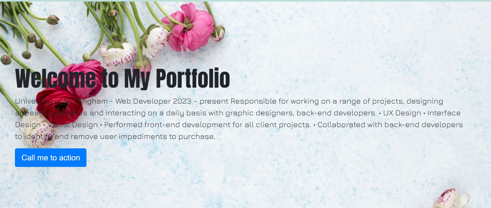

# Fiona-s-bootstrap-Portfolio
## Description


For this challenge I used the HTML CSS and Bootstrap Components Navbar jobotron cards to write my portfolio 
.Site is divided into several sections including Welcome ,Work ,About and Cotact .


## Table of Contents (Optional)


## Installation

I have add some <nav> <li> in the Navbar ,change the backgroud color delete the form bar.
wrote some portolio content in the <div> <h1><p>and added some background pictures in Jumbotron
Added some background images in the cards and  change the card titles
Added another Jumbotron 
Added a footer


Provide instructions and examples for use. Include screenshots as needed.

To add a screenshot, create an `assets/images` folder in your repository and upload your screenshot to it. Then, using the relative filepath, add it to your README using the following syntax:

    ```md

  





https://cui1818.github.io/Fiona-s-bootstrap-Portfolio/

    

## Credits


## License

